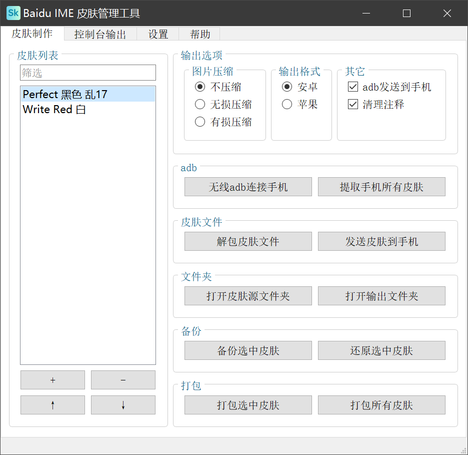

[Gitee](https://gitee.com/haujet/baidu-ime-skin-manage-tool)　|　[Github](https://github.com/HaujetZhao/baidu-ime-skin-manage-tool) 

#  Baidu IME 皮肤管理工具

## 💡 简介

这个工具可以用于解包、管理、打包、发送百度手机输入法皮肤。

### 📝 背景

大概百度输入法皮肤制作者最烦的过程就是这些重复性工作了吧：

* 打包皮肤
* 解包皮肤
* 版本管理，打包备份，不小心改错后还原
* 将手机的皮肤提取到电脑
* 将皮肤打包后发到手机查看效果

繁杂重复的事情就应该自动化，为了解决上述问题，我做了这样一个图形界面工具，用于管理皮肤源代码，并且能一键提取手机皮肤、解包、备份、压缩图片、打包、发送皮肤到手机。

## 🔮 使用

因为依赖库太简单，我就不打包了，可以直接从源代码使用

### 🛠 源代码使用

下载安装python之后，使用 `pip install PySide2` 安装 PySide2，然后双击源代码 `src` 文件夹中的 `__init__.pyw` 就可以运行了。

Linux、MacOS 用户请自行将 `src/bin` 文件夹中的可执行文件替换为对应系统的可执行文件：

* pngquant
* optipng
* adb

## ☕ 打赏

万水千山总是情，一块几块都是情。本软件完全开源，用爱发电，如果你愿意，可以以打赏的方式支持我一下：

## 😀 交流

如果有软件方面的反馈可以提交 issues，或者加入 QQ 群：[1146626791](https://qm.qq.com/cgi-bin/qm/qr?k=DgiFh5cclAElnELH4mOxqWUBxReyEVpm&jump_from=webapi) 